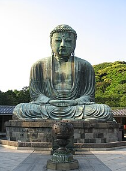

# Workshop 4 

By: Ethan Ehlert 

## Emphasis

Buddhism (/ˈbʊdɪzəm/ BUUD-ih-zəm, US also /ˈbuːd-/ BOOD-),[1][2][3] also known as *Buddha Dharma*, is an Indian religion[a] and philosophical tradition based on teachings attributed to the Buddha, a wandering teacher who lived in the 6th or 5th century BCE.[7] It is the world's fourth-largest religion,[8][9] with over 520 million followers, known as Buddhists, who comprise seven percent of the global population.[10][11] It arose in the eastern Gangetic plain as a śramaṇa movement in the 5th century BCE, and gradually spread throughout much of Asia. Buddhism has subsequently played a major role in Asian culture and spirituality, eventually spreading to the West in the 20th century.[12]


## Strong 

**According to tradition**, the Buddha instructed his followers in a path of development which leads to awakening and full liberation from dukkha (lit. 'suffering or unease'[note 1]). He regarded this path as a Middle Way between extremes such as asceticism or sensual indulgence.[17][18] Teaching that dukkha arises alongside attachment or clinging, the Buddha advised meditation practices and ethical precepts rooted in non-harming. Widely observed teachings include the Four Noble Truths, the Noble Eightfold Path, and the doctrines of dependent origination, karma, and the three marks of existence. Other commonly observed elements include the Triple Gem, the taking of monastic vows, and the cultivation of perfections (pāramitā).[19]

## Lists 

### Unordered Lists 

- List Item 1 
- List Item 2 


### Ordered Lists 
1. First Item 
2. Second Item 
3. Third Item 

## Images 



## Hyperlinks 

[Wikipedia talks Buddhism](https://en.wikipedia.org/wiki/Buddhism) 

## Including Code 

### Inline Code 

In HTML the `` tag is used to display pictures. 

## Code Fences 

```html
<nav>
        <ul>
          <li><a href="index.html">Home</a></li>
          <li><a href="grid.html">Grid</a></li>
          <li><a href="https://trentu.ca">Trent</a></li>
          <li><a href="https://loki.trentu.ca">Loki</a></li>
        </ul>
      </nav>
```

```css
body {
  font-family: system-ui, -apple-system, BlinkMacSystemFont, "Segoe UI", Roboto,
    Oxygen, Ubuntu, Cantarell, "Open Sans", "Helvetica Neue", sans-serif;
  height: 100vh;
  display: flex;
  flex-direction: column;
}
```